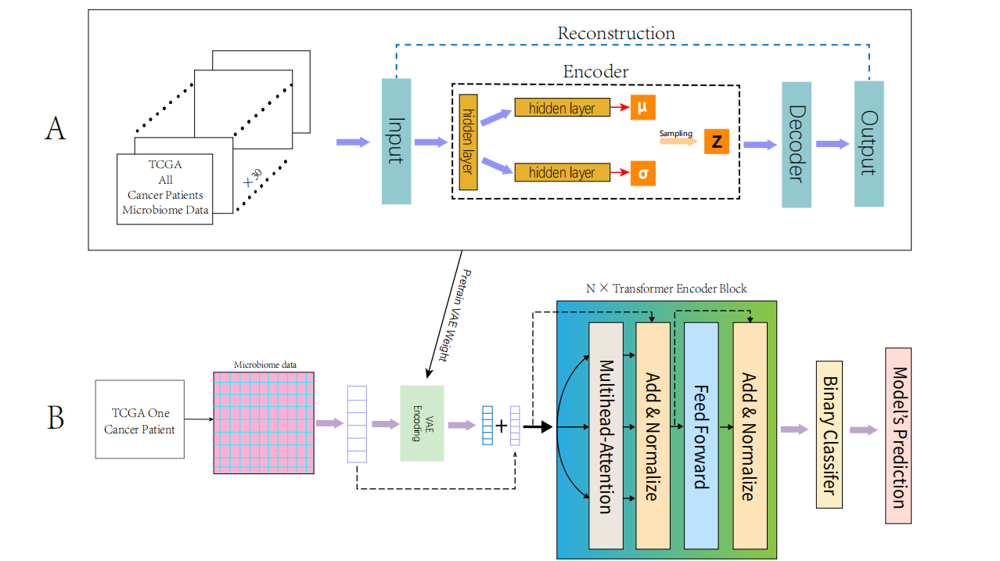

# VTrans: A VAE-based Pre-trained Transformer Method for Microbiome Data Analysis

## Introduction
In this paper, we introduce a VAE-based pre-trained Transformer method for microbiome data analysis deep learning model called VTrans, which is built upon a pre-trained VAE and Transformer encoder. The main goal of VTrans is to enhance the feature representation of individual datasets using a large-scale microbiome dataset of cancer patients, and to assess patient risk. Additionally, inspired by the concept of computer vision saliency maps, we calculate the saliency of microbiota to determine their impact on different cancer diseases, thus aiding in medical analysis. Initially, the model utilizes a pre-trained VAE for feature transformation. Following the transformation, we merge the transformed features with the original ones. Then, we employ a Transformer encoder for deep feature extraction. Finally, patient risk assessment is completed through a classifier. After training the model, microbiome saliency computation is achieved using a method similar to saliency map calculation of computer vision.

## Installations
* Windows
* NVIDIA GPU (both pretrained VAE and trained VTrans on a single Nvidia GeForce RTX 3090)
* ``pip install -r requiremnts.txt``

## Data preprocessing
If you wish to perform data preprocessing, you can run the script in the Jupyter folder.

## Pre-train VAE
``python pretrain_vae/vae_main.py``

## Training VTrans
``python VTrans/main.py``
